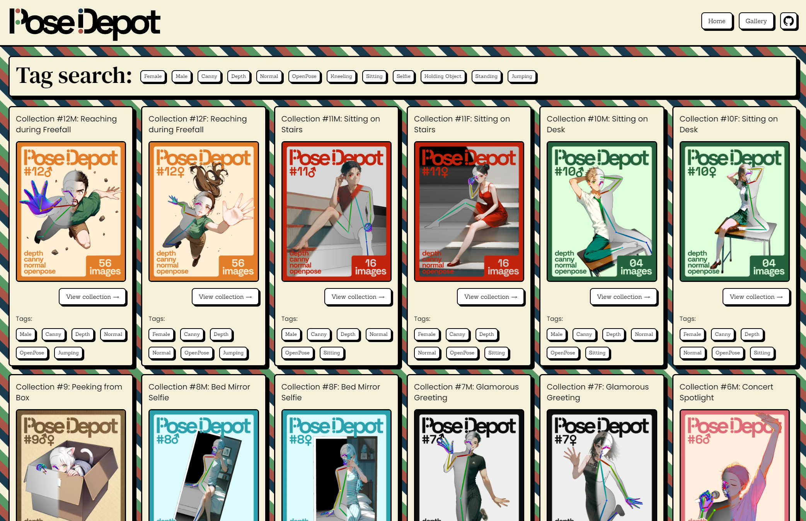
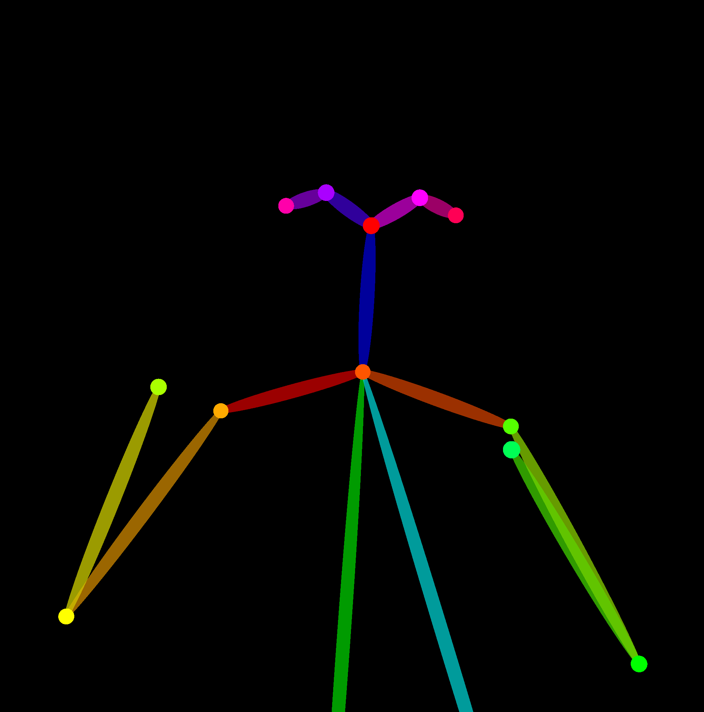
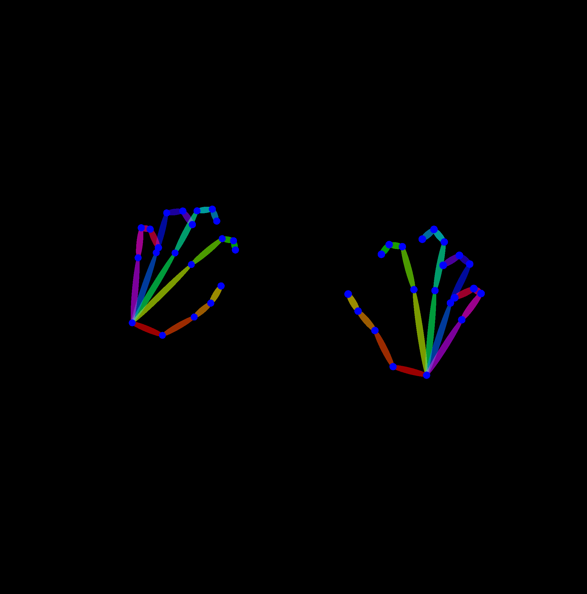
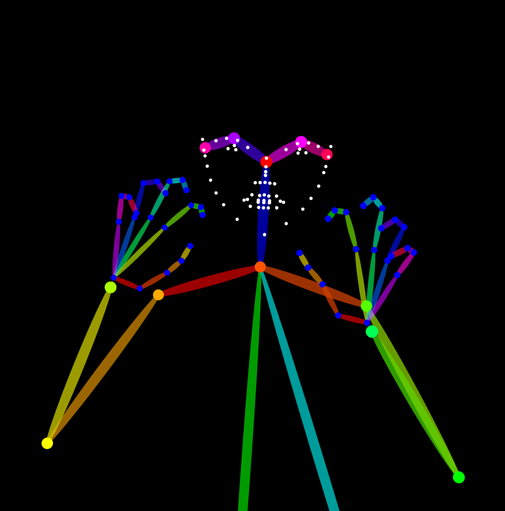
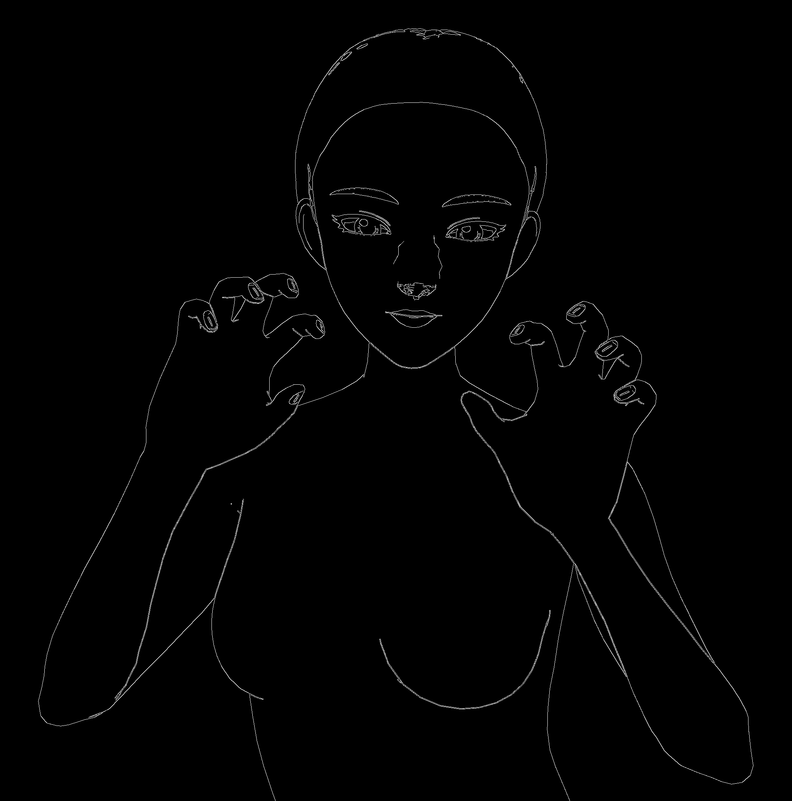
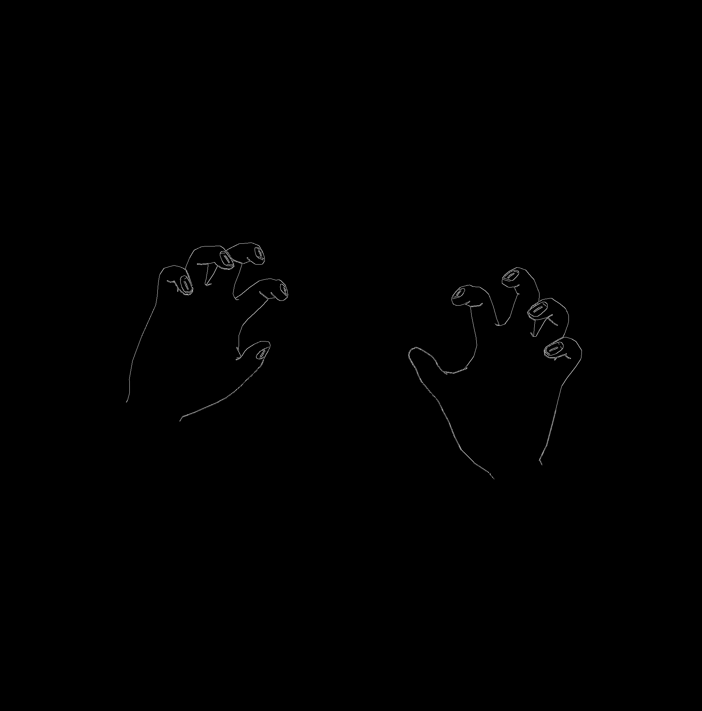
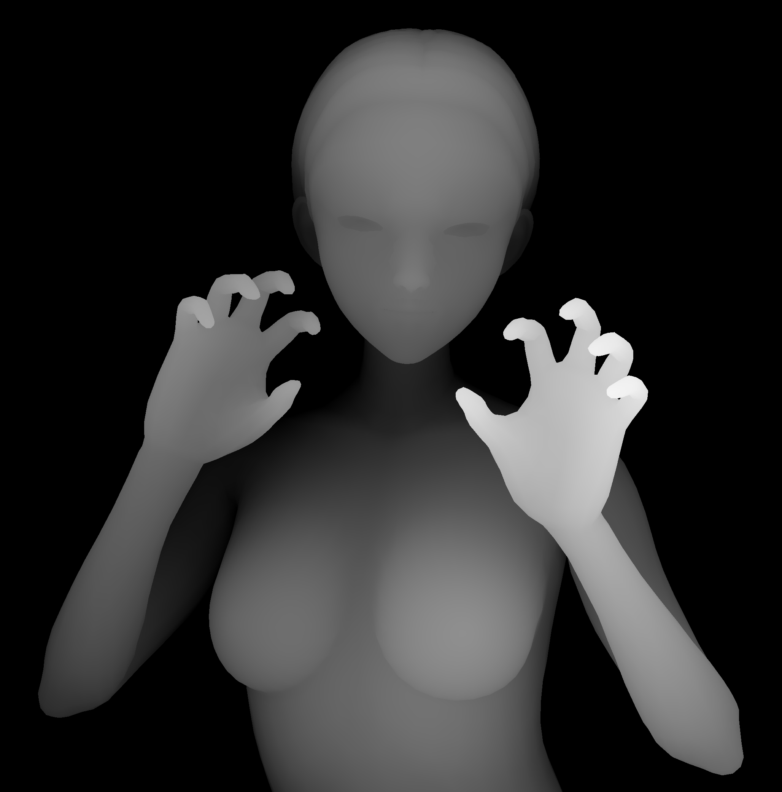
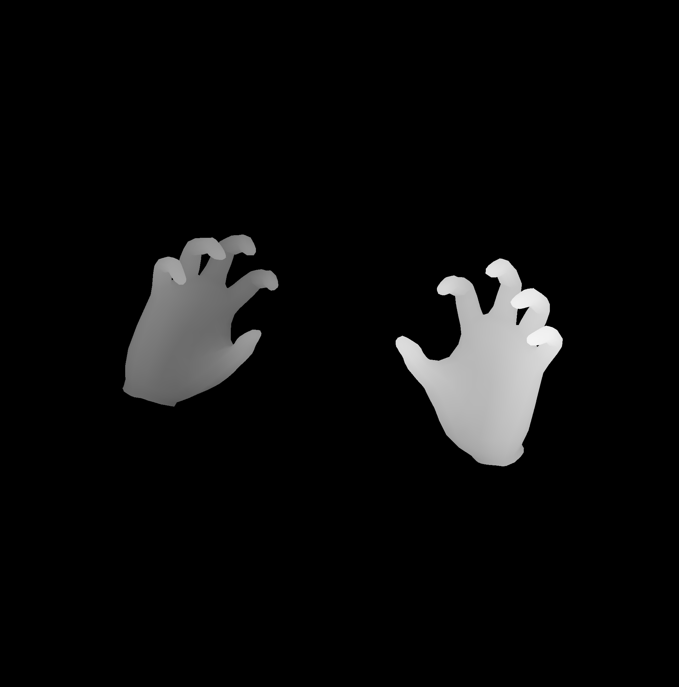
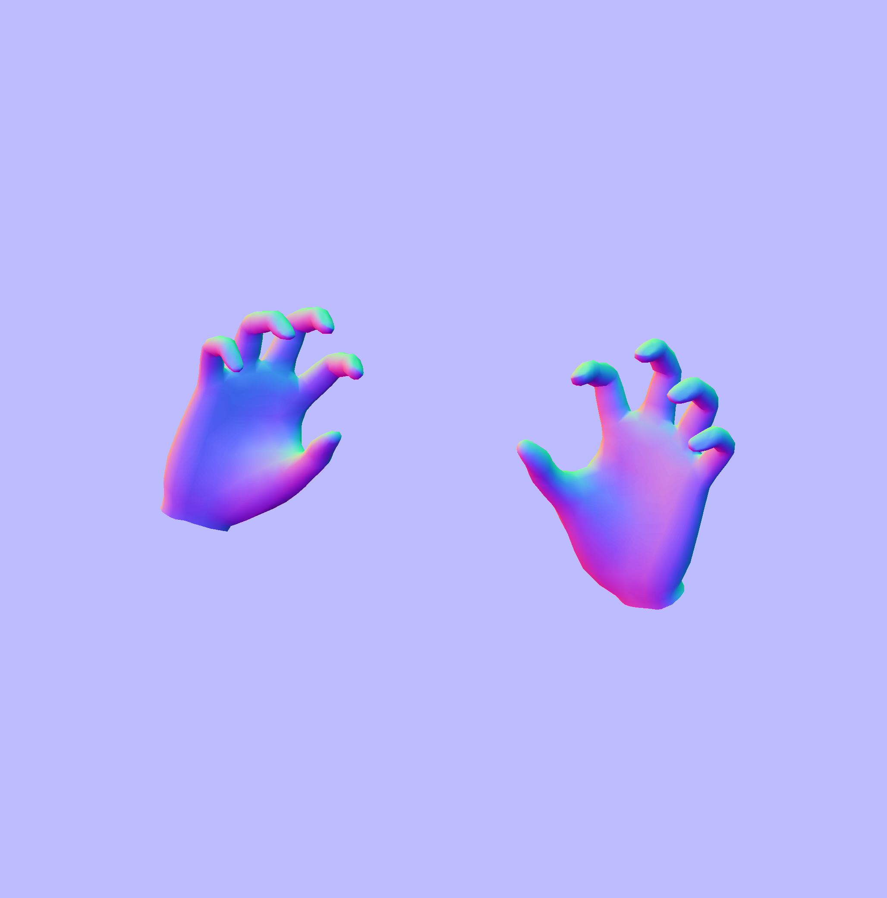

 

    

A collection of ControlNet poses.
    

 

    

##

Pose Depot is a project that aims to build a high quality collection of images depicting a variety of poses, each provided from different angles with their corresponding depth, canny, normal and OpenPose versions.
The aim is to provide a comprehensive dataset designed for use with ControlNets in text-to-image diffusion models, such as Stable Diffusion, providing an additional layer of control to the image generation process.

The pose collections can be downloaded directly from [Releases](https://github.com/a-lgil/pose-depot/releases), but with ease of exploration in mind, I've created a [webpage](https://a-lgil.github.io/pose-depot/gallery/) that allows users to conveniently browse, filter by tags, and view the different collections and their content. Bear in mind that the webpage is still a WIP. You can access it by clicking on the image below:

 

    <a target="_blank" href="https://a-lgil.github.io/pose-depot/gallery/">

 

> \[!IMPORTANT]
>
> **Star the repository** if you want to receive all release notifications from GitHub without any delay. It also helps motivate me to keep updating the project. \~ ⭐️

## 🤝&nbsp;Missing a specific pose? Found a bug? Have a question?

Feel free to [**file a new issue**](https://github.com/a-lgil/pose-depot/issues/new/choose) specifying the type of request/issue you're experiencing. We'll be happy to help you out!

When asking for a specific pose, please make sure that it complies with the GitHub Community Guidelines and Terms of Service.
For private inquiries, you can reach out to me via the email address provided in my GitHub profile.

If you already found a solution to your problem or want to contribute with your own poses, we would love to review your pull request!

## 🚀&nbsp;Usage

After downloading a pose collection, you will find multiple variants of the same pose, each with a different style applied to it. Here's a brief explanation of each style:

- **OpenPose**: The pose is displayed as an [OpenPose](https://github.com/CMU-Perceptual-Computing-Lab/openpose) skeleton, with its corresponding keypoints highlighted. It can be used to replicate the pose without copying other details like outfits, hairstyles, and backgrounds, leaving room for the model to generate its own details.

    | OpenPose | OpenPoseHand | OpenPoseFull |
    |---|---|---|
    |  |  |  |

- **Canny**: The pose is displayed in black and white, with the edges of the pose highlighted. It can be used to condition the outline/silhouette of the pose in the generated image, retaining the pose's structure while allowing the model to generate the details.

    | Canny | CannyHand |
    |---|---|
    |  |  |

- **Depth**: The pose is displayed as a depth map in grayscale, allowing the model to understand what parts of the pose are closer or farther away, providing a sense of perspective and distance in the generated image.

    | Depth | DepthHand |
    |---|---|
    |  |  |

- **Normal**: The pose is displayed as a normal map with the pose's surface normals represented in RGB colors, providing information about the pose's orientation and lighting. It can be used to help the model generate realistic lighting effects and shadows.

    | NormalHand |
    |---|
    |  |

Depending on your use case or your preferences, you can choose to use one or more of these styles together to condition the generated image. In my case I tend to start with Depth and Canny, and then add OpenPose and Normal if needed.

| Example Result |
|---|
|  |

If you are a beginner and don't know where to start, I recommend checking out [Stable Diffusion web UI](https://github.com/AUTOMATIC1111/stable-diffusion-webui) and its [ControlNet extension](https://github.com/Mikubill/sd-webui-controlnet) to understand how to use these poses in text-to-image diffusion models. You can use [Stability Matrix](https://github.com/LykosAI/StabilityMatrix) to streamline the installation process.

> \[!TIP]
>
> You can use the generation parameters from the example image included in every pose collection as reference.

## 💻&nbsp;Software & Tools

This project was developed using the following software and tools:

- [Affinity Photo](https://affinity.serif.com/designer/)
- [Affinity Designer](https://affinity.serif.com/photo/)
- KKS Chara Studio
- [ControlNet material generator for KKS](https://koikatsumodshop.booth.pm/items/5909983) by ai.hogefuge
- [Space Grotesk Font](https://floriankarsten.github.io/space-grotesk/) by [Florian Karsten](https://floriankarsten.com/)
- [Brutal Astro Theme](https://github.com/ElianCodes/brutal) by [ElianCodes](https://github.com/ElianCodes)
- [Stability Matrix](https://github.com/LykosAI/StabilityMatrix)
- [Stable Diffusion web UI](https://github.com/AUTOMATIC1111/stable-diffusion-webui)

## 🎨&nbsp;Disclaimer: About Moral and Ethical Implications

I am firmly against art theft, however I believe that text-to-image diffusion models are amazing tools that when used responsibly and ethically, while unable to replace human creativity, can be a great way to democratize art and design, enabling even non-artists like me to prototype, iterate over designs, and create what I can envision in my mind but cannot draw.

So, feel free to do whatever you want with these poses. There's no such thing such as more or less "pure" art. Just respect artists and don't go around stealing their art styles.

## 📘&nbsp;License

Pose Depot is released under the under terms of the [Apache License 2.0](LICENSE).
